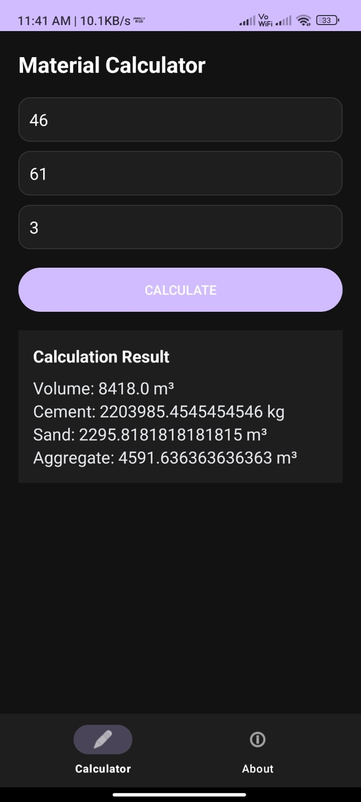
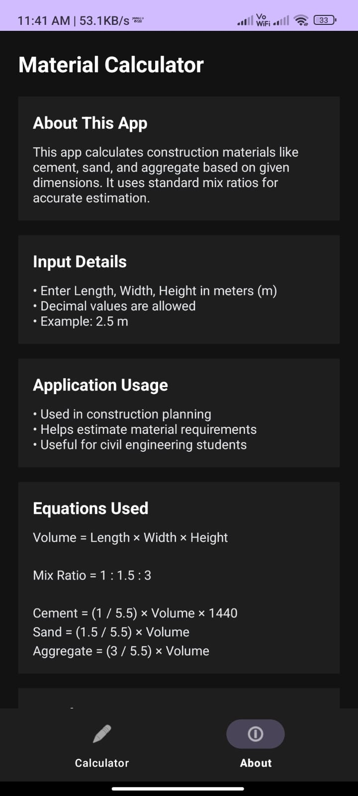

# 🏗️ Material Calculator App

A simple and efficient Android application designed to estimate construction materials such as cement, sand, and aggregate based on user input dimensions.

## 📱 Features
- Calculate volume using length, width, and height
- Estimate material quantities using standard mix ratio (1:1.5:3)
- Clean and modern dark UI
- Smooth navigation using fragments
- Numeric input with validation
- About section with project details and formulas

## 🧮 Calculations Used
- Volume = Length × Width × Height
- Cement = (1 / 5.5) × Volume × 1440
- Sand = (1.5 / 5.5) × Volume
- Aggregate = (3 / 5.5) × Volume

## 📌 Usage
This app is useful for:
- Civil engineering students
- Construction planning
- Quick material estimation

## 🛠️ Tech Stack
- Kotlin
- Android Studio
- XML UI
- Fragment-based navigation

## 📸 Screenshots

### Calculator Screen
![Calculator]

### About Screen
![About]

## 👨‍💻 Developer
Nikhil

## 🔗 Contact
https://nikhil-nadh-s.netlify.app/
